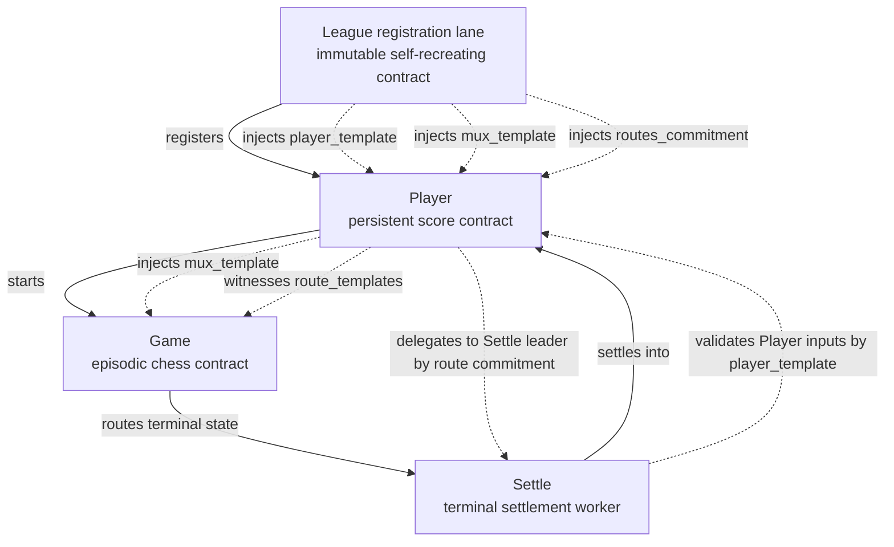
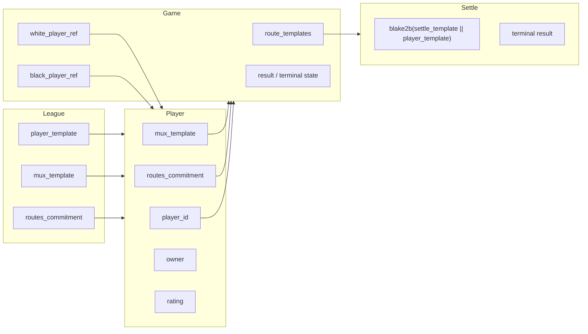

# Dependencies And Template Injection

This is the core structural picture.

## What each layer needs to know

Today `player_id` does not come from injected League state. It is derived as
`blake2b("LeaguePlayerId" || outpoint_txid || outpoint_index_le32)`, so the
domain is fixed by the contract code itself.

Today the game state binds each side as `blake2b(owner || player_id)`, not as a
raw `player_id`. That keeps the game-side footprint to one field per side while
still letting settlement recover canonical player ids from `Player` inputs.

Today `League` and `Player` keep only `routes_commitment = blake2b(route_templates)`.
The full `route_templates` blob is supplied only when `Player.start_game` expands
that commitment into a concrete game state.

Today that `route_templates` blob includes both:

- the move-worker family hashes
- a terminal settlement commitment at the tail:
  `blake2b(settle_template || player_template)`

That tail commitment lets `ChessMux.settle` safely witness the concrete settle
template and the trusted `player_template` together before materializing a
`ChessSettle` state.

## Why shared covenant id is not enough by itself

With one shared covenant id:

- `League`, `Player`, and `Game` are all in the same covenant family
- covenant-id grouping is enough to prove they belong to the same system
- covenant-id grouping is **not** enough to prove their role

So settlement needs both:

1. same cov-id group
2. role validation by template hash

That is why the design depends on:

- injected `player_template`, `mux_template`, and `routes_commitment`
- input-side template validation primitives

And that is also why the terminal game route keeps a commitment to both
`settle_template` and `player_template`, rather than only a bare settle worker hash.
