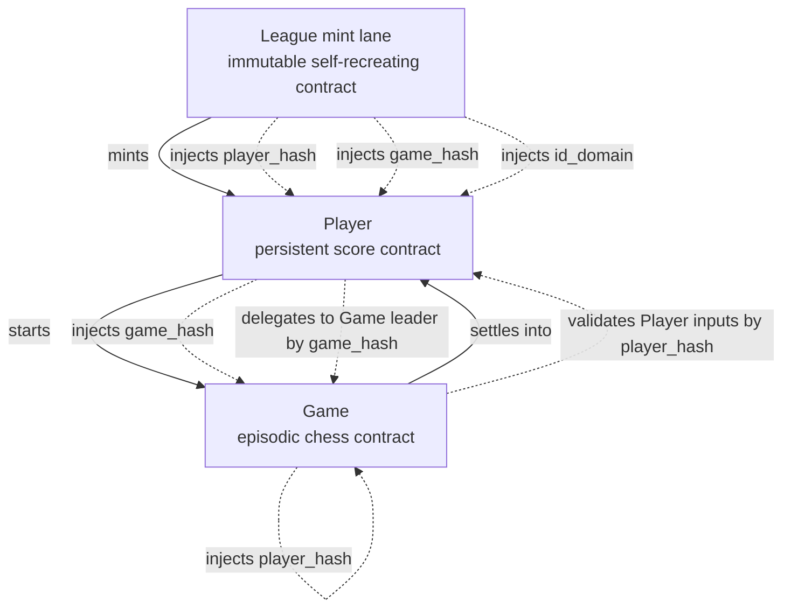
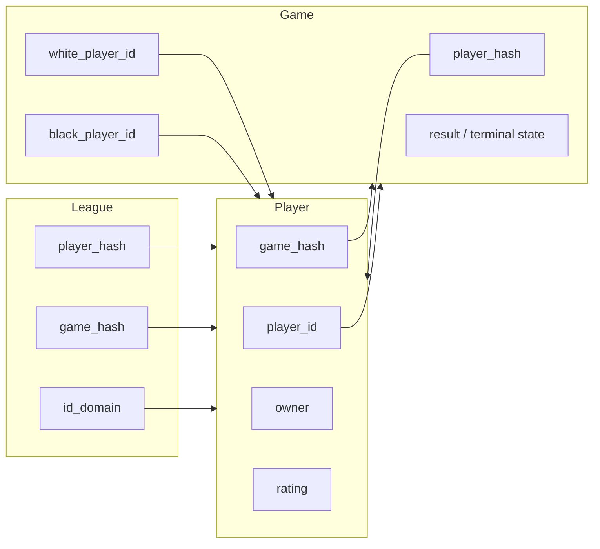

# Dependencies And Template Injection

This is the core structural picture.

## What each layer needs to know

## Why shared covenant id is not enough by itself

With one shared covenant id:

- `League`, `Player`, and `Game` are all in the same covenant family
- covenant-id grouping is enough to prove they belong to the same system
- covenant-id grouping is **not** enough to prove their role

So settlement needs both:

1. same cov-id group
2. role validation by template hash

That is why the design depends on:

- injected `player_hash` and `game_hash`
- input-side template validation primitives

