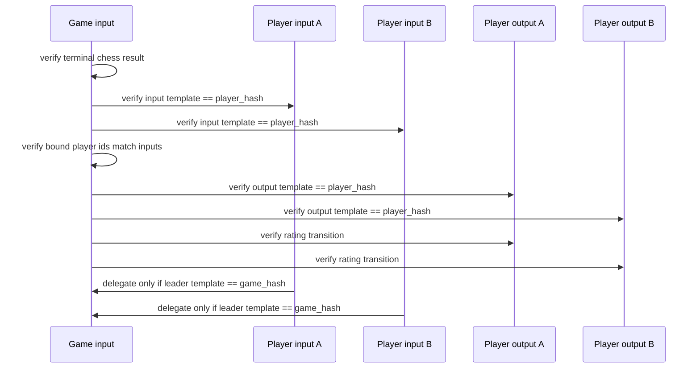

# Settlement Auth Shape

Target transaction:

`(game, player, player) -> (player, player)`

The intended auth split is:

- `Game` is the leader
- both `Player` inputs are delegates

## Missing primitive

For shared-cov-id settlement, the missing piece is an input-side role check such
as:

- `requireInputTemplate(idx, hash)`
- or `readInputStateWithTemplate(idx, prefix, suffix, hash)`
- or a direct `OpInputTemplateHash(idx)`

Without that, participants can prove same covenant group but not specific role.
