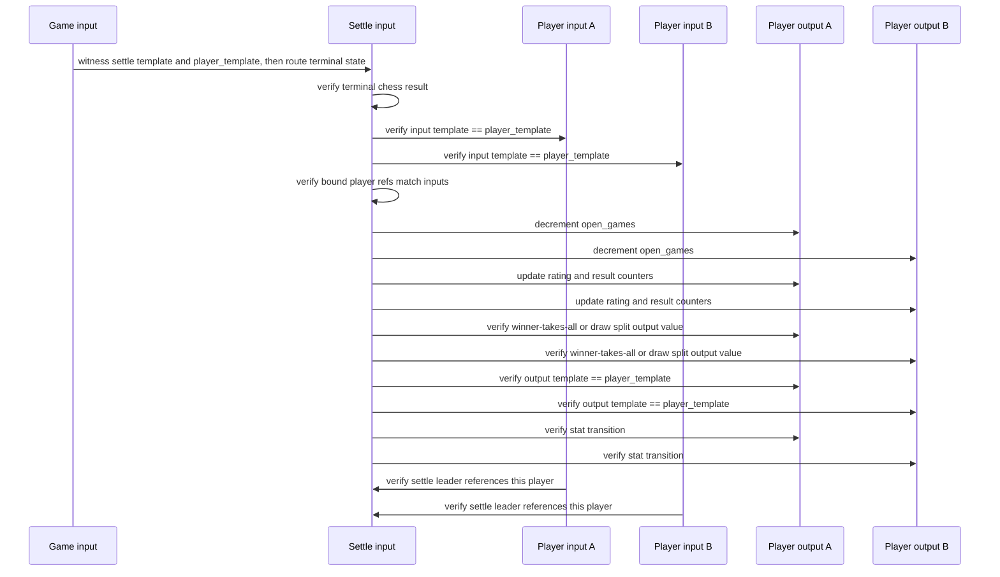

# Settlement Auth Shape

Target transaction:

`(game) -> (settle)` then `(settle, player, player) -> (player, player)`

The intended auth split is:

- `ChessMux` routes terminal state into `ChessSettle`
- the terminal route tail is a commitment to `blake2b(settle_template || player_template)`
- `ChessSettle` is the settlement leader
- both `Player` inputs are delegates
- `ChessSettle` validates both `Player` outputs and the objective payout split
- player delegates only verify that the leader is the expected terminal settle contract

## Current Slice

What is implemented now:

- `ChessMux` routes a terminal mux state into `ChessSettle`
- that route is authenticated against the tail commitment
  `blake2b(settle_template || player_template)`
- `ChessSettle` settles into two `Player` outputs
- settlement requires both players to have `open_games > 0`
- settlement decrements `open_games` for both players
- settlement increments `games`
- terminal result updates `wins` / `draws` / `losses`
- settlement applies the bounded Elo-style rating update
- settlement validates objective KAS payouts on chain:
  winner takes all, draw splits, odd extra goes to black
- `Player.delegate_settle` is fully signature-free and only verifies settle/player linkage

This means the durable layer now has one concrete lifecycle invariant:

- a `Player` can retire only when `open_games == 0`

And one concrete funds invariant:

- once a game UTXO has been created, its value is preserved through live play
- terminal settlement routes exactly that value into the two recreated `Player`
  outputs according to the objective result rule

What is still open:

- stronger guarantees around output ordering or template commitments if we want
  delegates to reason more directly about the produced `Player` outputs
- whether `Player.start_game` should also require `open_games == 0` and forbid
  overlapping games entirely
