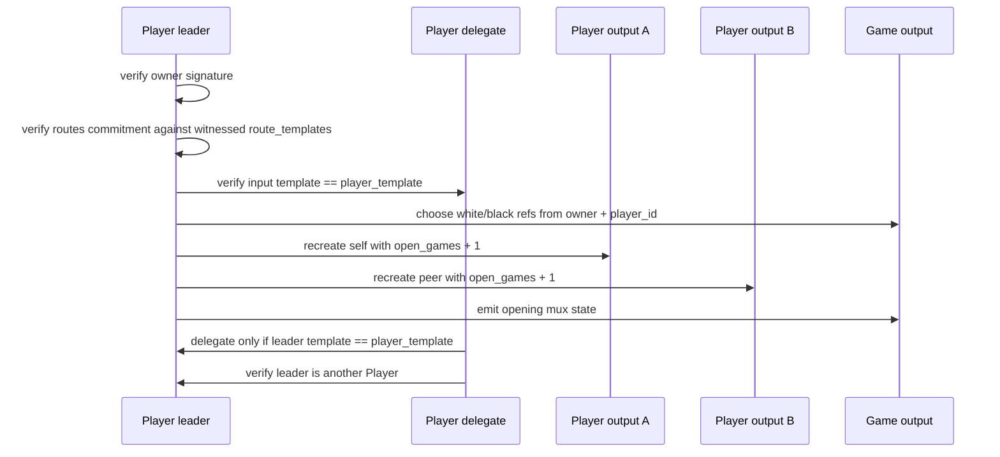

# Start Game Auth Shape

Target transaction:

`(player, player) -> (player, player, game)`

The current start-game split is:

- one `Player` input leads
- the other `Player` input delegates
- the leader recreates both durable players and materializes one opening
  `ChessMux` state
- both recreated players increment `open_games`

## Why this split is useful

The leader does the expensive work:

- reading the peer player state
- checking the witnessed `route_templates`
- constructing the opening game state
- validating all three outputs

The delegate stays small:

- it proves shared participation in the same covenant transition
- it proves the leader is actually another `Player`
- it signs so game start is still consensual

That is a useful general pattern for multi-input covenant transactions:

- one input owns the full transition proof
- the other inputs only verify enough to avoid being dragged into the wrong
  role or family

## Current Limitations

This first cut does now record live participation by incrementing
`open_games`, which is enough to block account retirement while a game is open.

So today the start-game path proves:

- both players consented
- the game state was materialized correctly
- both players now have one more open game on their durable record

But it does not yet prove:

- a player cannot participate in overlapping games

That stronger exclusivity rule would require an additional policy check such as
`open_games == 0` at game start. We have not enabled that yet.
