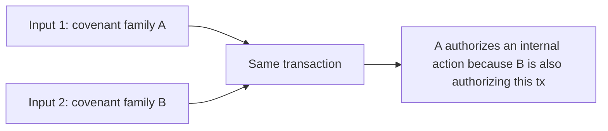

# Webinar: SilverScript, Covenants, ICC, And MCF

## SilverScript Overview

SilverScript is a contract language for covenant-style state machines on Kaspa.
For this session, the important mental model is:

- each spend is a state transition
- outputs are not just recipients, they are the next program states
- multiple covenant inputs can collaborate in one transaction
- different contracts can live under one shared covenant family

That last point is why chess is such a good example. It is not one big
contract. It is a system of contracts.

## Covenants

For this talk, a covenant is best understood as:

- a contract that constrains how its own UTXO may be spent
- often by validating the exact next output state
- sometimes by validating a foreign output state under another template

The key output-side primitives in the chess example are:

- `validateOutputState(...)`
- `validateOutputStateWithTemplate(...)`

Those two are enough to express both:

- self-recreation
- controlled routing into peer contracts

## Covenant Ids And Related Macros

One shared covenant id is used across the chess family:

- `League`
- `Player`
- `ChessMux`
- workers
- `ChessSettle`

That gives us family membership, but not role identity.

So the design uses two layers:

1. covenant id says "this input belongs to the same system"
2. injected template selectors say "this input/output is specifically a Player,
   Mux, worker, or Settle"

That is why the contracts carry fields such as:

- `player_template`
- `mux_template`
- `route_templates`
- `routes_commitment`

## ICC: Inter-Covenant Communication

For this webinar, ICC should be understood as a cross-family authorization
pattern, not as part of the internal chess flow.

The basic idea is:

- input 1 belongs to covenant family A
- input 2 belongs to covenant family B
- covenant A inspects input 2 and says:
  "if B is also authorizing this same transaction, I authorize something on my
  side too"

The communication channel is therefore not plain-text messaging. It is shared
transaction authorization.

A simple example is a native-asset covenant:

- the asset covenant marks an owner through a covenant id
- instead of re-running that owner covenant's logic internally, it checks that
  another input in the same transaction belongs to that covenant family
- because the transaction only validates if all inputs pass, that other
  covenant has effectively co-authorized the action

That means ICC can range from:

- direct knowledge between covenant families
- to looser tandem authorization patterns where two covenant families simply
  agree on the same transaction

Chess is not doing that. Chess stays inside one shared covenant family and uses
internal role separation instead:

- `League` mint `Player`
- `Player` mint `ChessMux`
- `ChessMux` route into workers
- `ChessMux` route terminal state into `ChessSettle`
- `ChessSettle` settle back into `Player`

## MCF: Multi-Contract Flows

The chess example demonstrates two flavors of multi-contract flow.

### Multiplexing

Use one entry contract to:

- authenticate intent
- commit pending state
- choose one worker template

Then let the worker prove one bounded claim and route back.

That is the mux pattern.

### Role Systems

Use different contracts for different durable and episodic roles:

- `League`: root allocator and public entry lane
- `Player`: durable identity and score shell
- `ChessMux`: episodic game checkpoint
- workers: bounded move and challenge validators
- `ChessSettle`: terminal settlement worker

That is the larger chess-system pattern.

So the high-level split for the talk is:

- ICC: crossing covenant-family boundaries by shared transaction authorization
- chess: one covenant family, many internal contracts, many internal roles
