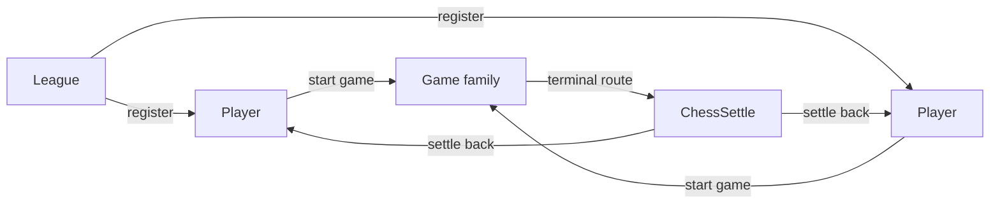
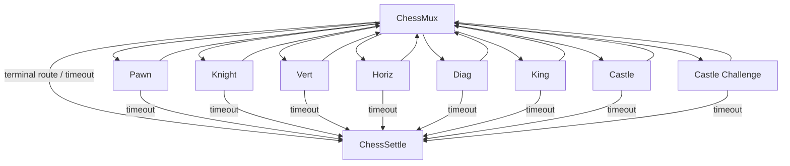
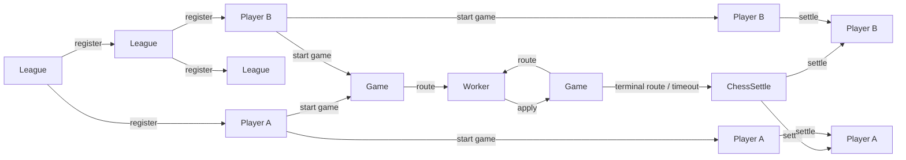

# Webinar: Chess As A Multi-Contract System

Chess extends the mux idea into a full multi-role covenant system.

## Zoom Out: The Outer Contracts

Start with the outer shells and ignore the inner move engine for a moment.

Role split:

- `League`: root allocator and public registration lane
- `Player`: durable identity, funds shell, and score record
- `Game`: episodic chess state machine
- `ChessSettle`: terminal worker for payout and score updates

This is the core MCF message:

- not one contract with many branches
- a system of contracts with different responsibilities

## Zoom In: The Game Family

Inside the game lane, the system narrows again into mux plus workers.

The branching is not arbitrary. Each worker owns one bounded claim:

- pawn-specific rules
- knight geometry
- straight-line sweeps
- diagonal sweeps
- king rules
- castling
- castle challenge proofs

That is the second big teaching point:

- split a large function into bounded validators
- let the mux route into the one validator that matches the claimed transition

## Transaction Entity Flow

Here is the covenant-entity flow through the main lifecycle.

What changes in each phase:

### `1 -> 2` League register player

- one immutable league lane recreates itself
- one fresh player account is emitted
- the league injects:
  - `player_template`
  - `mux_template`
  - `routes_commitment`

### `2 -> 3` Players start game

- both durable player states are recreated
- both increment `open_games`
- one opening `ChessMux` state is created
- game funding is defined here by mutual consent

### `1 -> 1` Game step

- `ChessMux` authenticates the side to move
- commits the pending move into game state
- routes into the selected worker as `1 -> 1`
- the worker applies one bounded transition as `1 -> 1`
- so one logical game step is two covenant transactions:
  - `Game -> Worker`
  - `Worker -> Game`

There are two subtle control points worth showing live:

- player commitment is checked at mux exit
- timeout escape exists on every worker

### `3 -> 2` Game settle

Settlement has two outputs:

- KAS value settlement
- rating / score settlement

`ChessSettle` enforces both:

- objective payout split
  - winner takes all
  - draw splits with the odd extra unit going to black
- objective durable score transition
  - decrement `open_games`
  - increment `games`
  - update `wins / draws / losses`
  - apply the bounded Elo-style rating update

That is what makes the final stage permissionless once the result is fixed.

## What This Example Teaches

The chess example is not mainly about chess.

It teaches:

- template injection as secure contract family bootstrapping
- mux/worker multiplexing as bounded verification
- multi-role covenant systems under one family
- timeout escape as a liveness primitive
- objective terminal settlement as the way out of post-result bargaining
