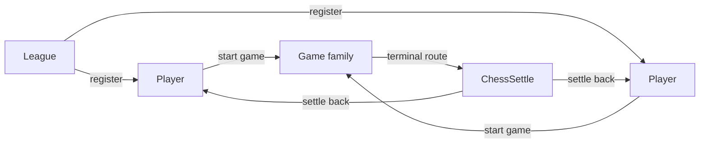
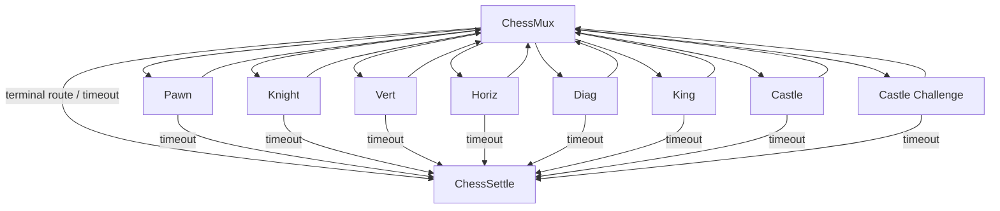
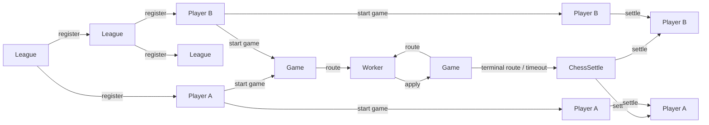

# Webinar: Chess As A Multi-Contract System

Chess extends the mux idea into a full multi-role covenant system.

## Zoom Out: The Outer Contracts

Start with the outer shells and ignore the inner move engine for a moment.



Role split:

- `League`: root allocator and public registration lane
- `Player`: durable identity, funds shell, and score record
- `Game`: episodic chess state machine
- `ChessSettle`: terminal worker for payout and score updates

This is the core MCF message:

- not one contract with many branches
- a system of contracts with different responsibilities

## Zoom In: The Game Family

Inside the game lane, the system narrows again into mux plus workers.



The branching is not arbitrary. Each worker owns one bounded claim:

- pawn-specific rules
- knight geometry
- straight-line sweeps
- diagonal sweeps
- king rules
- castling
- castle challenge proofs

That is the second big teaching point:

- split a large function into bounded validators
- let the mux route into the one validator that matches the claimed transition

## Transaction Entity Flow

Here is the covenant-entity flow through the main lifecycle.



What changes in each phase:

### `1 -> 2` League register player

- one immutable league lane recreates itself
- one fresh player account is emitted
- the league injects:
  - `player_template`
  - `mux_template`
  - `routes_commitment`

### `2 -> 3` Players start game

- both durable player states are recreated
- both increment `open_games`
- one opening `ChessMux` state is created
- game funding is defined here by mutual consent

Illustrative SIL excerpt:

```js
State next_self = {
    league_template: league_template,
    player_template: player_template,
    mux_template: mux_template,
    routes_commitment: routes_commitment,
    owner: owner,
    player_id: player_id,
    open_games: open_games + 1,
    rating: rating,
    games: games,
    wins: wins,
    draws: draws,
    losses: losses
};

require(OpAuthOutputCount(this.activeInputIndex) == 3);
validateOutputState(OpAuthOutputIdx(this.activeInputIndex, 0), next_self);
validateOutputState(OpAuthOutputIdx(this.activeInputIndex, 1), next_other);
validateOutputStateWithTemplate(
    OpAuthOutputIdx(this.activeInputIndex, 2),
    next_game,
    mux_prefix,
    mux_suffix,
    mux_template
);
```

### `1 -> 1` Game step

- `ChessMux` authenticates the side to move
- commits the pending move into game state
- routes into the selected worker as `1 -> 1`
- the worker applies one bounded transition as `1 -> 1`
- so one logical game step is two covenant transactions:
  - `Game -> Worker`
  - `Worker -> Game`

There are two subtle control points worth showing live:

- player commitment is checked at mux exit
- timeout escape exists on every worker

Illustrative SIL excerpt:

```js
State next_state = {
    mux_template: mux_template,
    route_templates: route_templates,
    white_player: white_player,
    black_player: black_player,
    board: board,
    turn: next_turn,
    status: next_status,
    move_timeout: move_timeout,
    castle_rights: castle_rights,
    en_passant_idx: next_en_passant_idx,
    pending_src_idx: next_pending_src_idx,
    pending_dst_idx: next_pending_dst_idx,
    pending_promo: next_pending_promo,
    recent_castle: next_recent_castle,
    draw_state: next_draw_state
};

byte[32] target_template = all_route_templates.slice(hash_start, hash_end);
validateOutputStateWithTemplate(
    output_idx,
    next_state,
    target_prefix,
    target_suffix,
    target_template
);
```

This is the mux doing the two jobs that matter:

- commit the pending move into shared state
- route into exactly one worker template

### `3 -> 2` Game settle

Settlement has two outputs:

- KAS value settlement
- rating / score settlement

`ChessSettle` enforces both:

- objective payout split
  - winner takes all
  - draw splits with the odd extra unit going to black
- objective durable score transition
  - decrement `open_games`
  - increment `games`
  - update `wins / draws / losses`
  - apply the bounded Elo-style rating update

That is what makes the final stage permissionless once the result is fixed.

Illustrative SIL excerpt:

```js
if (status == WWIN) {
    white_output_value = white_output_value + stake;
} else if (status == BWIN) {
    black_output_value = black_output_value + stake;
} else {
    int white_share = stake / 2;
    int black_share = stake - white_share;
    white_output_value = white_output_value + white_share;
    black_output_value = black_output_value + black_share;
}

require(tx.outputs[white_output_idx].value == white_output_value);
require(tx.outputs[black_output_idx].value == black_output_value);
validateOutputStateWithTemplate(
    white_output_idx,
    next_white,
    player_prefix,
    player_suffix,
    player_template
);
validateOutputStateWithTemplate(
    black_output_idx,
    next_black,
    player_prefix,
    player_suffix,
    player_template
);
```

That is the terminal move from protocol logic back into durable player state:

- calculate the payout split
- enforce the output values
- recreate both player states with updated scores

## What This Example Teaches

The chess example is not mainly about chess.

It teaches:

- template injection as secure contract family bootstrapping
- mux/worker multiplexing as bounded verification
- multi-role covenant systems under one family
- timeout escape as a liveness primitive
- objective terminal settlement as the way out of post-result bargaining
