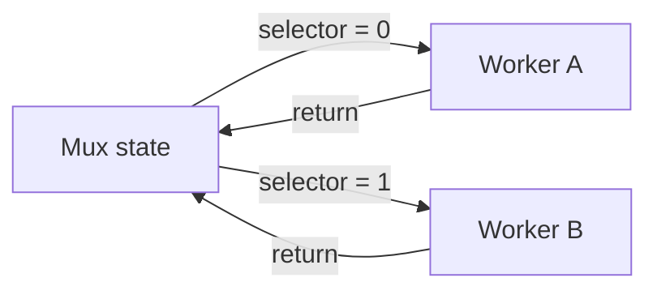

# Webinar: The Basic Mux Pattern

This page is based on [examples/mux/sil/mux.sil](/home/pool/michael/kaspanet/silverscript/examples/mux/sil/mux.sil).

The mux pattern is the smallest useful multi-contract flow:

- one contract owns the shared state
- it chooses one worker based on a selector
- it emits that worker with the same state
- the worker does one narrow job
- the worker returns to the mux

## The State Machine

The important trick is that each state spot also carries the next transition
function implicitly.

- when the active UTXO is `Mux`, the next legal spend begins with `Mux.route`
- when the active UTXO is `Worker A`, the next legal spend begins with
  `A.apply` or `A.timeout`
- when the active UTXO is `Worker B`, the next legal spend begins with
  `B.apply` or `B.timeout`

So the UTXO is doing two jobs at once:

- the current application state
- the next legal transition entrypoint

## Template Injection Through Immutable State

The mux example injects peer templates into immutable state:

- `mux_template`
- `a_template`
- `b_template`

Why inject them instead of deriving them recursively?

- peer contracts need to know where they are allowed to route
- but recursive template hashing creates cycles
- so the family is declared explicitly in immutable state at construction time

This is the first important multi-contract pattern:

- carry trusted peer templates in state
- use them later to validate foreign outputs

## Why A Naive Mux Can Stall

The naive mux pattern is elegant, but incomplete.

If a worker can be entered and then never exited, the system can stall:

Two missing ingredients cause that problem:

- no commit discipline
- no timeout escape

### Commit

The mux should commit the exact pending claim before routing.

Otherwise:

- the worker does not know what it is supposed to prove
- the return path is ambiguous

### Timeout

The worker should expose a timeout path.

Otherwise:

- a bad or stuck worker state can trap the whole application forever

The chess system keeps both:

- mux commits the pending move into shared state
- every worker exposes a timeout route

That turns the mux from a demo pattern into a live protocol pattern.
